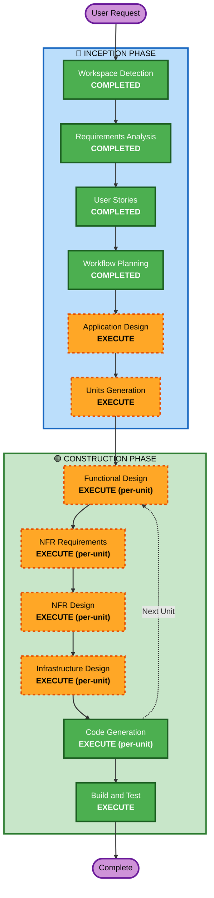

# Execution Plan

## Detailed Analysis Summary

### Change Impact Assessment
- **User-facing changes**: Yes - 고객 주문 UI + 관리자 대시보드 전체 신규 구축
- **Structural changes**: Yes - 전체 시스템 아키텍처 신규 설계 필요
- **Data model changes**: Yes - Store, Table, Menu, Order, OrderHistory, Session 등 신규 스키마
- **API changes**: Yes - REST API 전체 신규 설계 (인증, 메뉴, 주문, 테이블 관리, SSE)
- **NFR impact**: Yes - 실시간 통신(SSE), JWT 인증, bcrypt, 세션 관리

### Risk Assessment
- **Risk Level**: Medium (신규 프로젝트이나 복잡한 실시간 통신 및 세션 관리 포함)
- **Rollback Complexity**: Easy (Greenfield - 기존 시스템 영향 없음)
- **Testing Complexity**: Moderate (SSE 실시간 통신, 세션 라이프사이클 테스트 필요)

## Workflow Visualization



### Text Alternative
```
Phase 1: INCEPTION
  - Workspace Detection (COMPLETED)
  - Requirements Analysis (COMPLETED)
  - User Stories (COMPLETED)
  - Workflow Planning (COMPLETED)
  - Application Design (EXECUTE)
  - Units Generation (EXECUTE)

Phase 2: CONSTRUCTION (per-unit loop)
  - Functional Design (EXECUTE)
  - NFR Requirements (EXECUTE)
  - NFR Design (EXECUTE)
  - Infrastructure Design (EXECUTE)
  - Code Generation (EXECUTE)
  - Build and Test (EXECUTE)
```

## Phases to Execute

### 🔵 INCEPTION PHASE
- [x] Workspace Detection (COMPLETED)
- [x] Requirements Analysis (COMPLETED)
- [x] User Stories (COMPLETED)
- [x] Workflow Planning (COMPLETED)
- [ ] Application Design - EXECUTE
  - **Rationale**: 신규 프로젝트로 컴포넌트 식별, 서비스 레이어 설계, 데이터 모델 정의 필요
- [ ] Units Generation - EXECUTE
  - **Rationale**: 백엔드 API + 프론트엔드 UI + DB 스키마 등 다수 작업 단위로 분해 필요

### 🟢 CONSTRUCTION PHASE (per-unit)
- [ ] Functional Design - EXECUTE
  - **Rationale**: 각 unit별 데이터 모델, 비즈니스 로직, API 엔드포인트 상세 설계 필요
- [ ] NFR Requirements - EXECUTE
  - **Rationale**: JWT 인증, bcrypt, SSE 실시간 통신, 세션 관리 등 기술 스택 선정 필요
- [ ] NFR Design - EXECUTE
  - **Rationale**: 사용자 요청으로 포함. JWT 인증 흐름, SSE 패턴, 세션 관리 등 NFR 패턴을 논리적 컴포넌트로 설계
- [ ] Infrastructure Design - EXECUTE
  - **Rationale**: Docker Compose 구성, PostgreSQL 컨테이너, Spring Boot 서비스 매핑 필요
- [ ] Code Generation - EXECUTE (ALWAYS)
  - **Rationale**: 실제 코드 구현
- [ ] Build and Test - EXECUTE (ALWAYS)
  - **Rationale**: 빌드 및 테스트 지침 생성

## Success Criteria
- **Primary Goal**: 테이블오더 MVP 서비스 구현 (고객 주문 + 관리자 모니터링)
- **Key Deliverables**: Spring Boot 백엔드, Vanilla JS 프론트엔드, PostgreSQL 스키마, Docker Compose
- **Quality Gates**: 주문 생성→실시간 모니터링 E2E 흐름 동작, JWT 인증, SSE 실시간 업데이트
